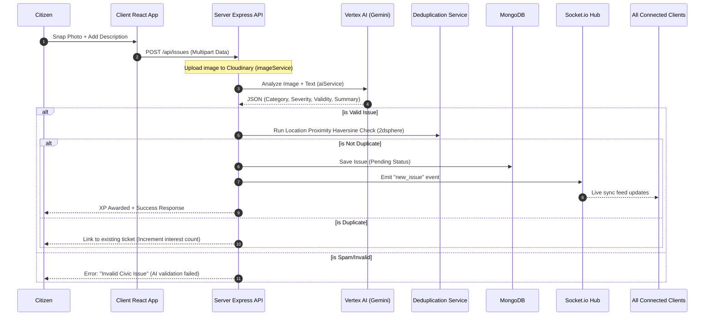
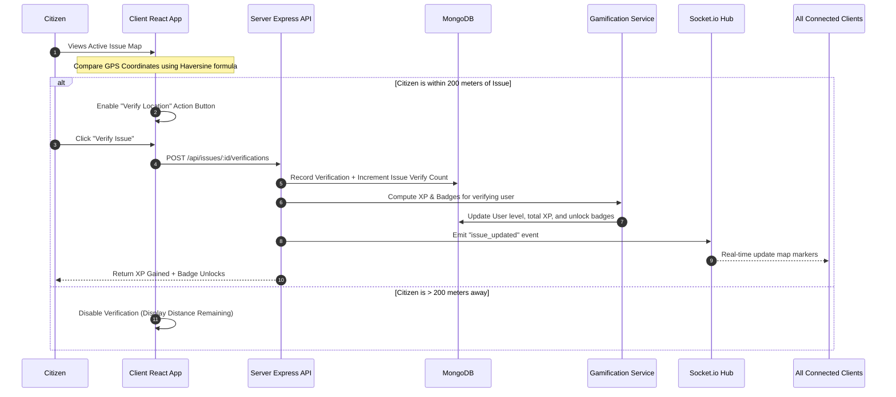

# 📍 StreetVoice — Civic Issue Reporting & Gamified Verification Platform

StreetVoice is a community-driven civic issue reporting and monitoring platform that bridges the gap between citizens and local municipal authorities. By combining **artificial intelligence**, **geospatial verification**, and **player-style gamification (XP, badges, leaderboards)**, the platform incentivizes citizens to keep their neighborhoods clean while streamlining ticket resolution for municipal departments.

---

## 📋 Problem Statement (PS)

Traditional civic complaint platforms suffer from several critical bottlenecks:
1. **Reporting Fatigue & Friction**: Citizens find it tedious to fill out long forms, determine the correct municipal category, or assess issue severity.
2. **Spam & False Reports**: Municipalities are overwhelmed by duplicate complaints, vague reports, or non-civic spam.
3. **Lack of Trust & Transparency**: Once a complaint is filed, citizens have no visibility into its status, leading to disengagement.
4. **No Verification Mechanism**: There is no easy way for other citizens to verify if a reported problem exists or has been fixed, requiring municipal staff to do manual site visits for validation.

### The StreetVoice Solution
* **Insta-Report via AI**: Citizens snap a photo of an issue (e.g. pothole, broken streetlight). Vertex AI (Gemini 1.5 Flash) instantly validates the image, categorizes it, and scores its severity.
* **Geospatial Crowdsourced Verification**: Other citizens in the vicinity can walk to the coordinates (tracked via Leaflet Maps and GPS) and "Verify" the issue if they are within 200 meters, filtering out duplicates and fake reports.
* **Civic Gamification**: Citizens earn Experience Points (XP), unlock custom badges, and climb regional leaderboards for reporting, verifying, and commenting, driving viral civic participation.
* **Real-time Live Synced Feed**: Real-time event notifications via Socket.io ensure updates are immediate across active dashboards.
* **Authority Control Center**: A dedicated portal for municipal departments to update ticket status (Pending ➡️ In Progress ➡️ Resolved), track SLAs, and view predictive maintenance insights.

---

## 📂 Project Structure & Key Files

```text
streetvoice/
│
├── client/                          # React PWA Frontend (Vite)
│   ├── public/                      # Static assets, manifest, & SW
│   │   ├── index.html               # Main entry point
│   │   └── manifest.json            # PWA install configuration
│   ├── src/
│   │   ├── main.jsx                 # Vite application bootstrapper
│   │   ├── App.jsx                  # Main router and layout orchestrator
│   │   ├── components/              # Reusable UI components
│   │   │   ├── common/              # Theme-compatible buttons, cards, loading states
│   │   │   ├── dashboard/           # Metrics, SLA charts, and geo maps
│   │   │   └── layout/              # Responsive containers, BottomNav, gamification cards
│   │   ├── context/                 # State management (Auth, Socket)
│   │   ├── hooks/                   # Custom Hooks (useSocket, useMapSocket, useAuth)
│   │   ├── pages/                   # User views (Home, Leaderboard, Citizen Portal, Authority Portal)
│   │   ├── services/                # Axios API call bindings
│   │   └── utils/                   # Location distance calculations (Haversine)
│   ├── package.json                 # Frontend dependencies (React 19, Tailwind CSS 4, Framer Motion)
│   └── vite.config.js               # Vite bundler configuration
│
├── server/                          # Node.js + Express Backend
│   ├── src/
│   │   ├── index.js                 # Express app setup & Socket.io server entry point
│   │   ├── config/                  # DB connection, Cloudinary, and Vertex AI configs
│   │   │   ├── db.js                # MongoDB Mongoose connector
│   │   │   ├── cloudinary.js        # Media storage setup
│   │   │   └── vertexai.js          # Google Cloud Vertex AI client
│   │   ├── controllers/             # Request handlers (API logic)
│   │   │   ├── authController.js    # Mobile OTP send/verify (Mock credentials in dev)
│   │   │   ├── issueController.js   # Creation, geolocation indexing, search
│   │   │   ├── verifyController.js  # Geospatial validation and XP allocation
│   │   │   └── authorityController.js# Status transition logs, SLA statistics
│   │   ├── models/                  # Mongoose DB Schemas
│   │   │   ├── User.js              # Citizen/Authority profiles, XP levels, badges
│   │   │   ├── Issue.js             # Geospatial points, status, verifications
│   │   │   ├── Verification.js      # User verification ledger
│   │   │   ├── Comment.js           # Feedback threads
│   │   │   └── StatusUpdate.js      # Audit history for ticket transitions
│   │   ├── services/                # Backend business services
│   │   │   ├── aiService.js         # Gemini 1.5 Flash Vision & Text analyzer
│   │   │   ├── gamificationService.js# Rule engine for XP calculation & badge rewards
│   │   │   └── deduplicationService.js# Geohash proximity matching for duplicate detection
│   │   ├── jobs/                    # Node-cron background daemons
│   │   │   └── escalationJob.js     # Automatically escalates tickets exceeding SLAs
│   │   └── middleware/              # Express middlewares (JWT auth, error handler)
│   └── package.json                 # Backend dependencies (express, socket.io, mongoose, vertexai)
│
├── ai/                              # Prompt templates & response schemas
│   ├── prompts/                     # Structured instructions for Gemini analysis
│   └── schemas/                     # JSON schema constraints for LLM outputs
│
├── Dockerfile                       # Multi-stage Docker config for unified deployment
├── .dockerignore                    # Excluded build assets
└── docker-compose.yml               # Local multi-container development configuration
```

---

## 🔄 Detailed Workflows

### 1. Issue Reporting Workflow (AI + Duplication Check)


### 2. Location Verification Workflow (Haversine + Gamification)


### 3. Authority Escalation & Status Transition
* **Cron Daemons**: Background jobs (`escalationJob.js`) run on a daily schedule to find tickets that have been stuck in `Pending` or `In Progress` status for longer than their SLA limits (configured by severity). It automatically changes their status or increases priority to ensure accountability.
* **Status Updates**: When an authority logs in and updates a ticket:
  1. The `authorityController` records the transition in the `StatusUpdate` ledger.
  2. Updates the `Issue` status in MongoDB.
  3. Sends a push notification to the reporting citizen using Firebase.
  4. Emits a WebSocket update so other citizens looking at the map see the resolution instantly.

---

## 🚀 Deployment Architecture (Google Cloud Run)

StreetVoice is configured for a **unified single-container deployment** on Google Cloud Run. This architecture compiles the Vite React frontend during build time and copies the compiled assets directly into the Express backend's public directories.

```text
       [ User Browser ]
              │
              ▼ (HTTPS)
   ┌────────────────────────────────────────────────────────┐
   │                  Google Cloud Run                      │
   │            (Unified Express Container)                 │
   │                                                        │
   │  ┌──────────────────────┐    ┌──────────────────────┐  │
   │  │  Express Static App  │    │   Express API/REST   │  │
   │  │  (serves client/dist)│    │   (routes /api/*)    │  │
   │  └──────────────────────┘    └──────────────────────┘  │
   │                                          │             │
   │                                          ▼ (WebSockets)│
   │                                     [ Socket.io ]      │
   └──────────────────────────────────────────┬─────────────┘
          │                                   │
          ▼ (Vertex AI client SDK)            ▼ (Mongoose Driver)
    [ Vertex AI API ]                   [ MongoDB Atlas ]
   (Gemini 1.5 Flash)                  (Geospatial Cluster)
```

---

## 🛠️ Local Development Setup

### 1. Configure Environment Variables
Create `.env` files in both the `server` and `client` directories.

**Backend (`server/.env`):**
```ini
PORT=5000
MONGO_URI=mongodb+srv://<username>:<password>@cluster.mongodb.net/streetvoice
JWT_SECRET=super_secret_jwt_key
CLOUDINARY_CLOUD_NAME=your_cloudinary_cloud_name
CLOUDINARY_API_KEY=your_cloudinary_api_key
CLOUDINARY_API_SECRET=your_cloudinary_api_secret
GOOGLE_PROJECT_ID=streevoice
GOOGLE_LOCATION=us-central1
```

**Frontend (`client/.env`):**
```ini
VITE_API_URL=http://localhost:5000/api
```

### 2. Running Locally (No Containers)
```bash
# Run backend (from server directory)
cd server
npm install
npm run dev

# Run frontend (from client directory in a new terminal)
cd client
npm install
npm run dev
```
Visit the local client at `http://localhost:5173`.

### 3. Running Locally (Docker Compose)
To run everything locally in containers (including mock database/redis):
```bash
docker-compose up --build
```

---

## ☁️ Google Cloud Deployment Guide

Deployment is automated using **Google Cloud Build** and **Google Cloud Run**.

```bash
# 1. Login to Google Cloud
gcloud auth login

# 2. Select the target project
gcloud config set project streevoice

# 3. Submit build and deploy to Cloud Run
# This automatically reads the root Dockerfile, compiles Vite, bundles Express, and deploys.
gcloud run deploy streetvoice-service \
  --source . \
  --region us-central1 \
  --allow-unauthenticated \
  --set-env-vars "MONGO_URI=your_mongodb_atlas_uri,JWT_SECRET=your_jwt_secret,CLOUDINARY_CLOUD_NAME=your_cloudinary_name,CLOUDINARY_API_KEY=your_cloudinary_key,CLOUDINARY_API_SECRET=your_cloudinary_secret,GOOGLE_PROJECT_ID=streevoice,GOOGLE_LOCATION=us-central1,NODE_ENV=production"
```
Once deployed, Cloud Run will output your live URL (e.g. `https://streetvoice-service-515566578915.us-central1.run.app`).
