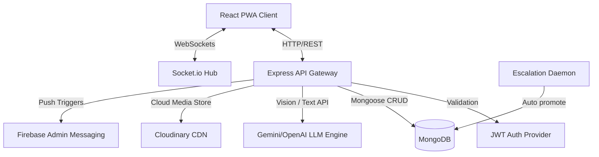

# Architecture & System Design

This document details the system design, tech stack choices, and data communication structures for **StreetVoice**.

## 1. System Overview

- **PWA Frontend**: Built using React and Vite. Employs CSS variables, Leaflet maps, and Socket.io client bindings.
- **Node.js/Express Backend**: Routes incoming JSON requests, uploads images to CDN, executes nearby haversine checks, and manages webhooks.
- **Real-time Engine**: Socket.io coordinates immediate feeds updates when citizens report issues or verifications occur.
- **Geo-spatial Layer**: MongoDB `2dsphere` indexes handle fast location queries.
- **Gamification Core**: Rule engine awarding XP and achievements for reporting/verifications.

## 2. Data Flow
1. **Reporting Flow**: Citizen snaps photo -> AI filters for spam/category -> Location pinned via maps -> Database registers Point -> Socket.io emits message -> Feeds update.
2. **Verification Flow**: Citizen walks near reported issue -> GPS checks distance (must be within 200m) -> Citizens verifies -> Database saves verification -> Socket updates state.
